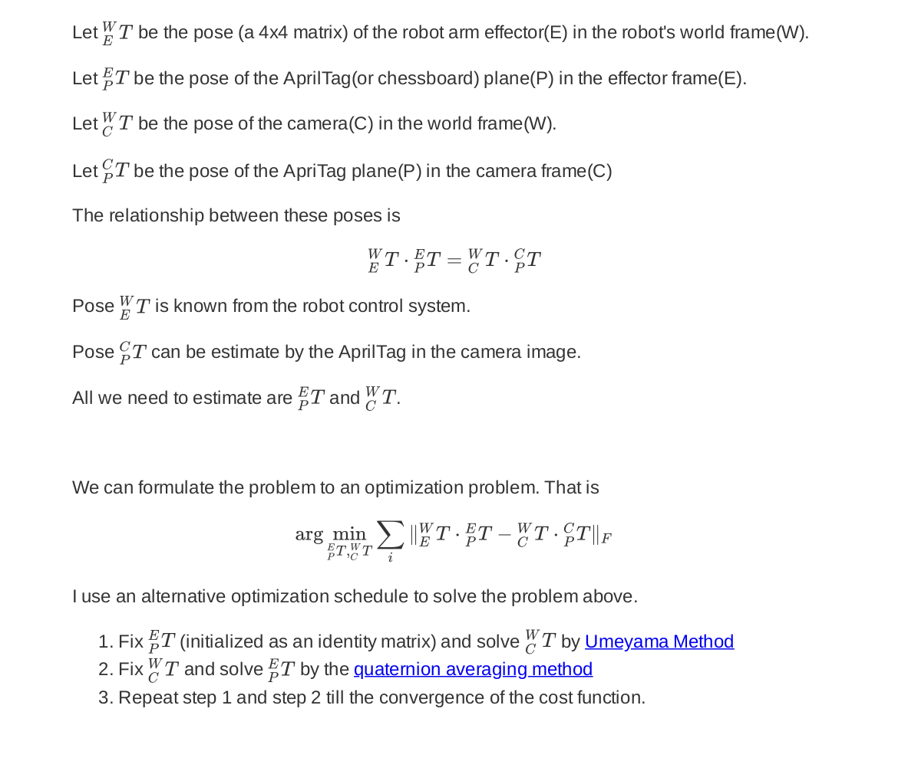

# Extrinsic Calibration

Hand-eye calibration. Three images is enough to get good result.

## Algorithm Details

## Results
### Before

### After

The estimated translation between camera and world frame is [1.50857135, -0.43450175, 2.58097087].
The ground-truth of the translation is [1.502617788, -0.43833321, 2.577397448]

## Project Dependencies
- opencv
- apriltag (pip install apriltag)
- open3d (with read_point_cloud_with_nan)
- numpy
- json

## References
1. [Least-Squares Rigid Motion Using SVD](https://igl.ethz.ch/projects/ARAP/svd_rot.pdf)
2. [Quaternion Averaging](https://ntrs.nasa.gov/archive/nasa/casi.ntrs.nasa.gov/20070017872.pdf)
3. [Unified Temporal and Spatial Calibration for Multi-Sensor Systems](https://furgalep.github.io/bib/furgale_iros13.pdf)